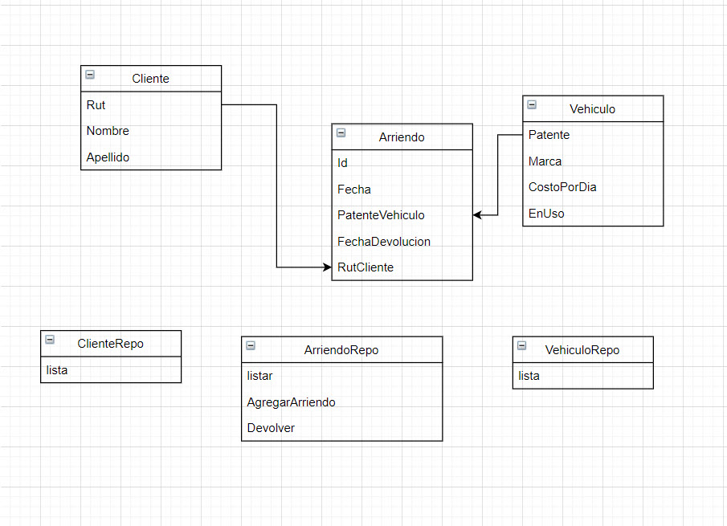
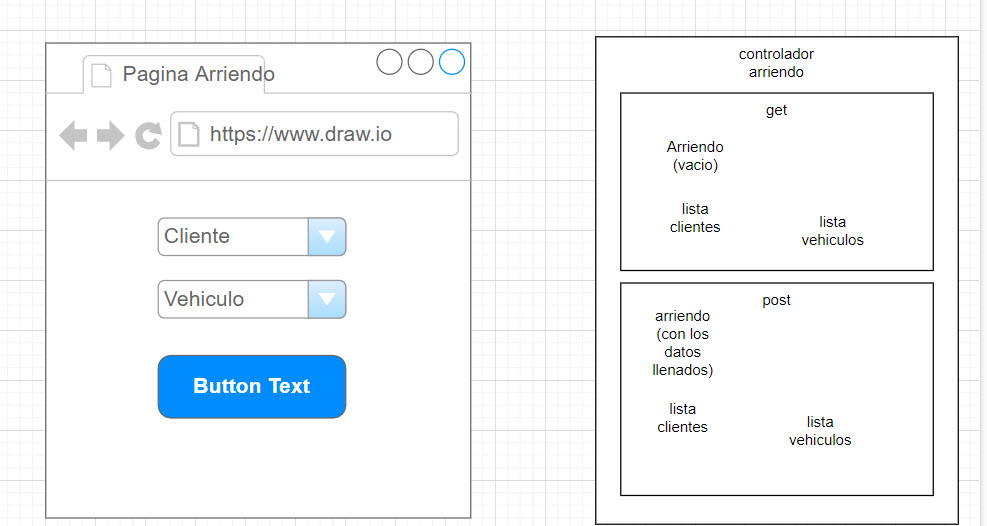
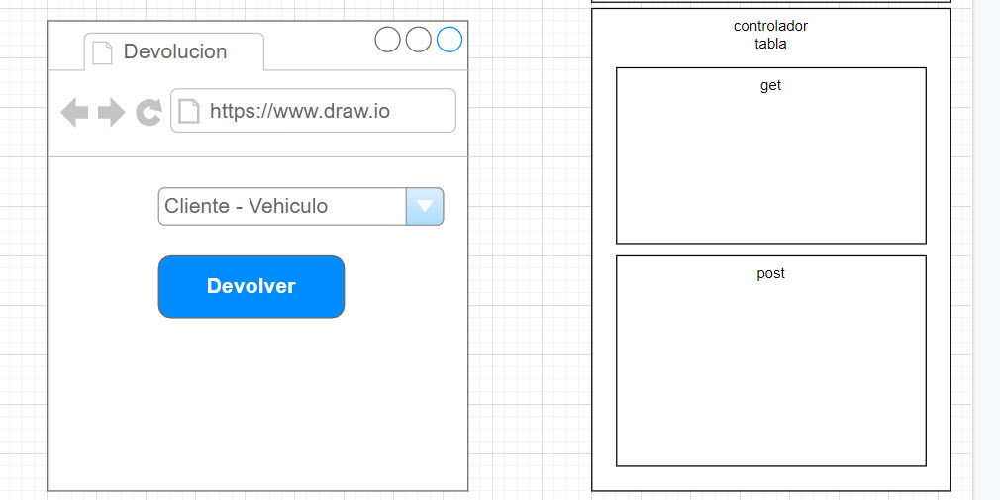
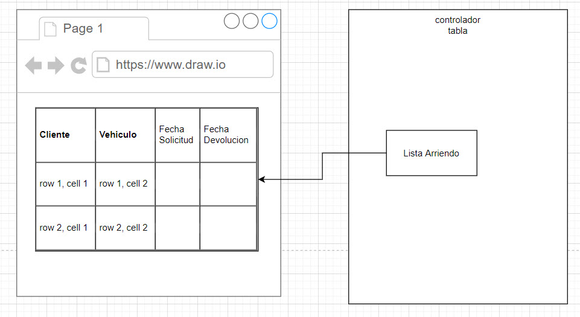

# programas

https://github.com/jgraph/drawio-desktop/releases/tag/v22.0.2

https://xmind.app/download/previous/










## 1 configurar el sistema

## 2 modificar el modelo 
Cree los modelos, los factory, seeder, las migracion y el controlador.
```bash
   php artisan make:model Cliente --all  
   php artisan make:model Vehiculo --all
   php artisan make:model Arriendo --all
```
Luego, modifique los modelos

## 3 crear las tablas

* Voy a modificar la migracion.

## 4 llenar las tablas con datos de ejemplo

* Luego, agregue datos con el factory o solo con el seed.

## 5 crear enrutamiento y controladores

Agregue los enrutamientos en routes/web.php

## 6 modificar el controlador

